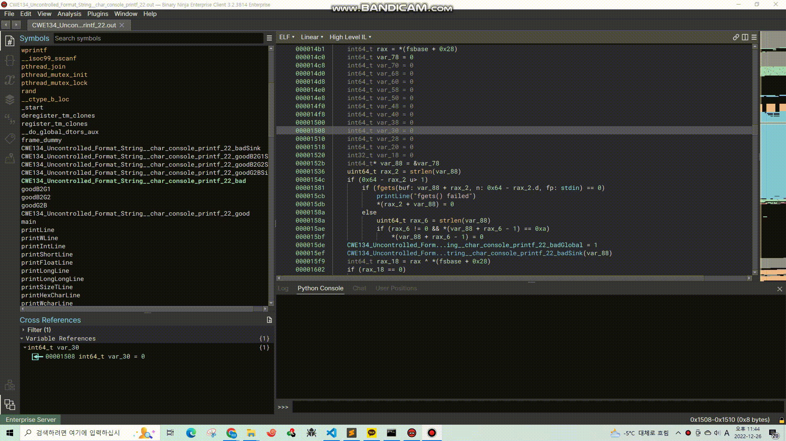

# TypeMagician
C Standard Library-based Type Conversion Binary Ninja Plugin

## Usage

## Etc
The json file was created by crawling the C standard function through `crawl_function.py`.
This plugin works as follows:
1. Read JSON file(`c_function_param.json`)
2. Analyze the parameters of the corresponding function(backward slicing)
3. Convert to the right type
